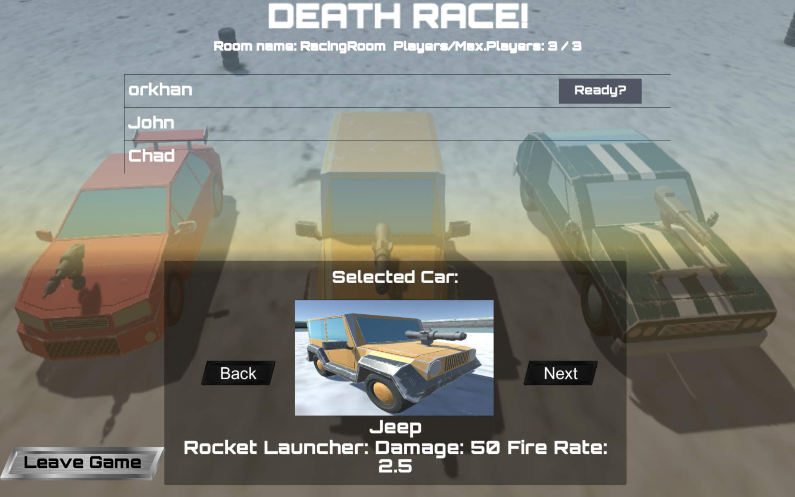
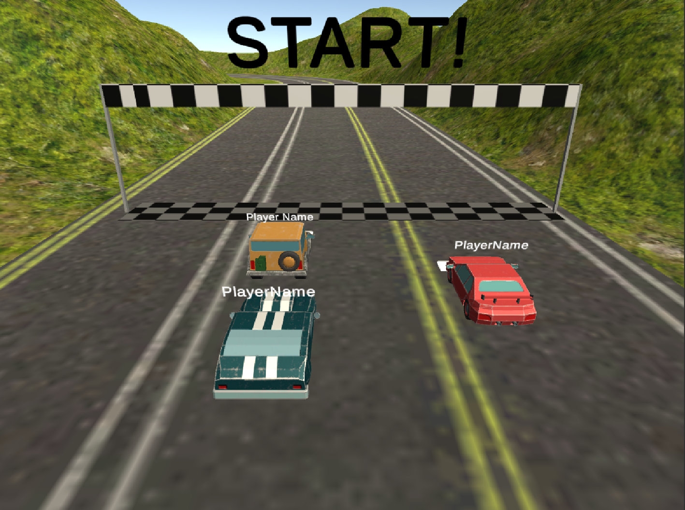
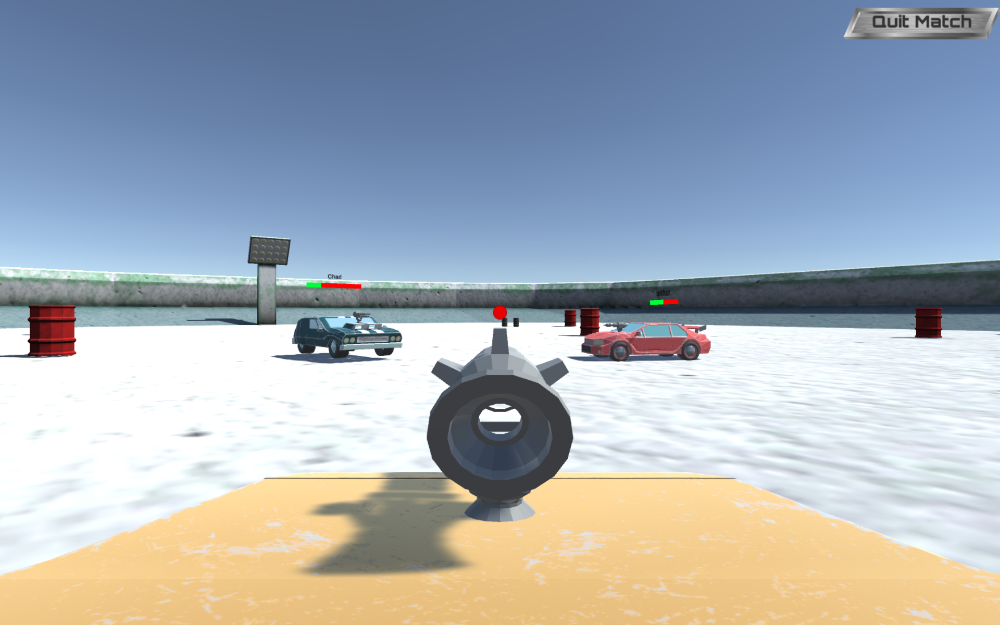

# Racing-Game
Multiplayer 3D Race-shooter game created using Unity and Photon Server.
This demo game was created for learning purposes. Particularly to improve in managing network connection via Photon Server.
The main focus of the project is to successfully connect multiple players into one game, handle interactions between them (shooting, destroying, driving).

## Screenshots and detailed description
#### Inside Room Panel - Room with the list of players currently waiting for the game to start. Select a car and press Ready!

#### Racing Mode - The winner will be the one who crosses the finish line first.

#### Death Race Mode - Destroy the enemies with three different weapons: Machine Gun, Rocket Launcher and Laser.

## Tools used while developing this project
- Unity.
- Visual Studio Code. Coding in C# Programming Language.
- GitBash.
- PUN (Photon Unity Networking).
- Inno Setup Compiler (For creating installation files)

## How to install?
### For Windows User
- Open Folder Named "Game" in Racing-Game repository.
- Click on RacingGameSetup.exe and download.
- Most probably you will face a warning message. Just Right click on warning and click "Save".
- Now you have an installer file! Open it.
- Windows Defender will prevent running it. Click "More Info" and Click "Run Anyway".
- Proceed with installing and enjoy the game!

## Game Description
### Game Keyboards
- WASD keys are for moving
- Space for shooting (In death race mode only)

## Contacts 
- E-mail address orkhan.elchuev@gmail.com
- https://github.com/OrkhanElchuev/Racing-Game
